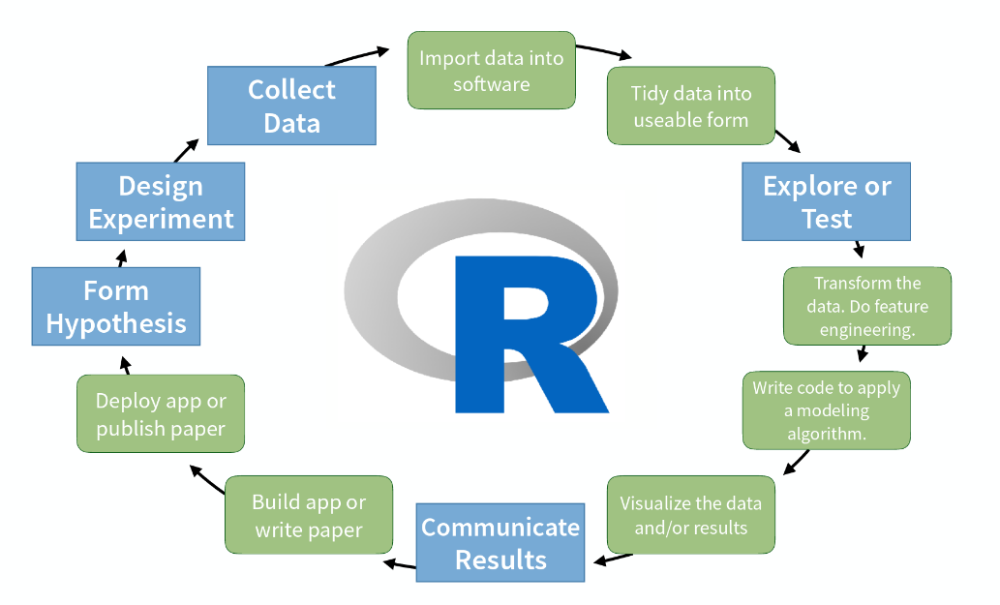
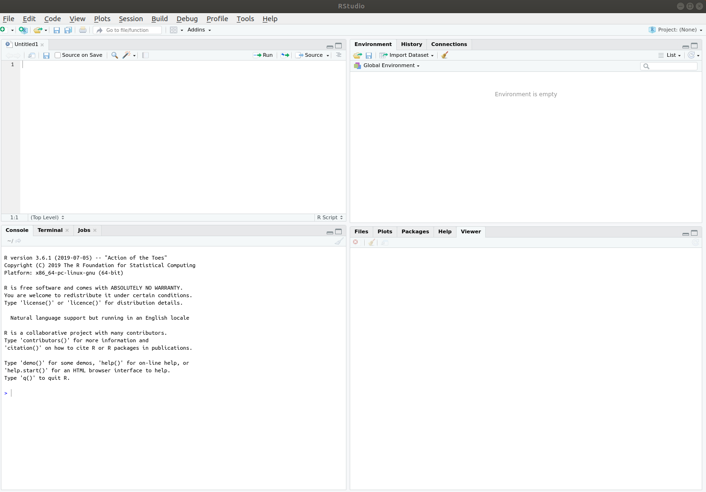
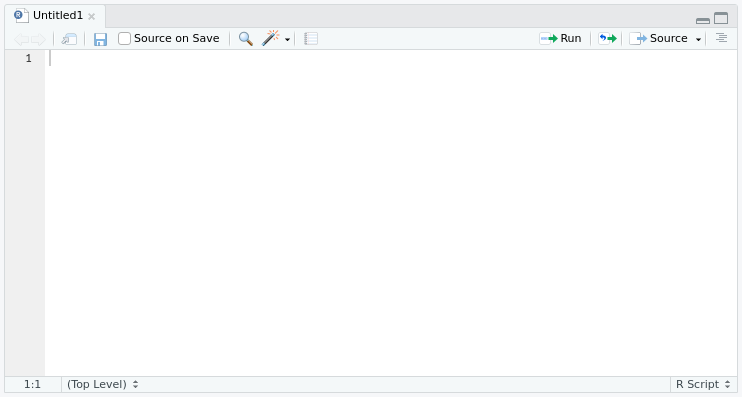
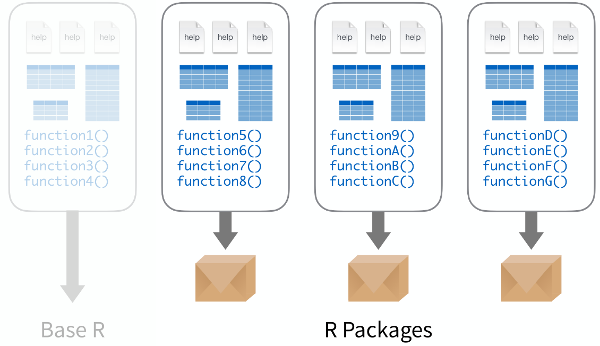

```{r, include = FALSE}
knitr::opts_chunk$set(
  collapse = TRUE,
  comment = "#>"
)
```

Contents borrowed and modified from [UVA's Data Science Essentials in R series](https://uvastatlab.github.io/phdplus/intror.html) and RStudio's [Master the Tidyverse](https://github.com/rstudio-education/master-the-tidyverse/blob/master/slides/00-Introduction.pdf) workshop.

## Installation

Instructions for how to install and/or update R, RStudio, and helpful R packages can be found [here](preworkshop_instructions.html).

## Features of R

* R is free!
* R is everywhere, and has an active user base. This is useful because you can find a lot of people in various disciplines using R in blogs, forums, Stack Overflow, etc., and you can often find help online there.
* R is flexible! Since R is open source, the active R user base implements new methods as libraries in R quickly. Over 10,000 packages are available.
* R is cool! It is highly regarded for its:
  + Graphical functionality. See [gplot2](https://ggplot2.tidyverse.org/),[ ggplot extensions](http://www.ggplot2-exts.org/gallery/).
  + Interactive web functionality. See [shiny](https://shiny.rstudio.com/gallery/).
  + Reproducible output, such as documents, presentations, and dashboards. See [markdown](https://rmarkdown.rstudio.com/gallery.html).
  + Easy integration with other open-source or data science applications, such as Sublime Text, Jupyter Notebooks, GitHub, etc.
  
```{r, echo=FALSE, out.width='90%', fig.align='center'}

```

## Orientation to R and RStudio

We recommend that you use R with RStudio. R is the base statistical computing environment. RStudio is an “Interactive Development Environment” makes it easy to use R. It does things like auto-complete, syntax highlighting, and is generally much easier to use. After you install R and RStudio, you only need to run RStudio. RStudio shows four panes by default. The two most important are the Console (bottom left) and the Script Editor (top left).  

This is what RStudio looks like when you first open it:

```{r, echo=FALSE, out.width='90%', fig.align='center'}

```

### Console (bottom left)

The console pane allows you to quickly and immediately execute R code. You can experiment with functions here, or quickly print data for viewing. Type next to the > and press Enter to execute.

```{r, echo=FALSE, out.width='90%', fig.align='center'}
knitr::include_graphics('images/console.png')
```

**Console Practice**

You can use R like a calculator. Try typing 2+5 into the console.

```{r}
2+8
```

Here, the plus sign is the **operator**. Operators are symbols that represent some sort of action. Of course, it would be silly if we only used R as a calculator. To use R more fully, we need to understand **objects**, **functions**, and **indexing** - which we will learn about as we go.

For now, think of *objects as nouns* and *functions as verbs*.

### Script Editor (top left)

In contrast to the Console, which quickly runs code, the Script Editor does not automatically execute code. The Script Editor allows you to save the code essential to your analysis. You can re-use that code in the moment, refer back to it later, or publish it for replication. When writing scripts do your future self a favor and use lots of comments! Preface comments with a hashtag: '#'. Good to know: R script files end with “.R”

```{r, echo=FALSE, out.width='90%', fig.align='center'}

```

**Running commands from a script**

To run code from a script, insert your cursor on a line with a command, and press CTRL+Enter/CMD+Enter.

Or highlight some code to only run certain sections of the command, then press CTRL+Enter/CMD+Enter to run.

Alternatively, use the Run button at the top of the pane to execute the current line or selection.

### Other Panes

```{r, echo=FALSE, out.width='90%', fig.align='center'}
knitr::include_graphics('images/other-panes.png')
```

The other panes are on the right of the screen.

* **Environment** (top): Lists all currently defined objects and data sets.
* **History** (top): Lists all commands recently used or associated with a project.
* **Connections** (top): Lists connections to data sources (e.g. Spark).
* **Files** (bottom): Shows the files available to you in your working directory.
* **Plots** (bottom): Graphical output goes here.
* **Packages** (bottom): Lists all installed packages. Packages with checks next to them are currently loaded.
* **Help** (bottom): Find help for R packages and functions. Don’t forget you can type ? before a function name in the console to get info in the Help section.
* **Viewer** (bottom): Renders HTML documents (created with RMarkdown).

## Using Packages

Packages contain functions, and all functions belong to packages. R comes with about 30 packages (“base R”). There are over 10,000 user-contributed packages; you can discover these packages online. A prevalent collection of packages is the Tidyverse, which includes `ggplot2`, a package for making graphics.

```{r, echo=FALSE, out.width='90%', fig.align='center'}

```

Only install a package once. It will likely install several other packages it depends on. You should have already installed `tidyverse` before the workshop.

You can install packages via point-and-click: `Tools`--> `Install Packages`. Enter `tidyverse` (or a different package name) then click `Install`.

Or you can use this command in the console: `install.packages("tidyverse")`

You must load the package in any new R session where you want to use that package. Loading `tidyverse` will load other depdendent packages, including `ggplot2`.

```{r, echo=FALSE, out.width='90%', fig.align='center'}
knitr::include_graphics('images/using-packages.png')
```

### Installing packages from GitHub

While there are many useful packages hosted on the CRAN (the global repository of R packages queried using `install.packages()`), you may be interested in using packages that are still in development. Many of these packages are shared on GitHub and can be downloaded using `install_github()`, a function of the `devtools` package. Below is an example of how to install the `workr` package using `devtools`.

```{r, eval=FALSE}
install.packages("devtools")
devtools::install_github("https://github.com/natalieoshea/workr.git") 
## If it asks to install or update packages, be sure to select "CRAN packages only" to ensure that stable packages are not replaced by bug-prone development versions
```

Including `devtools:::` before `install_github()` allows you to call the function without having to load the entire library. However, if you are planning to use additional functions from the `devtools` package you may want to fully load the package (`library(devtools)`--> `install_github()`)

## View and Change Your Working Directory

The working directory is where R pulls files to work with. This is where your datasets, scripts, etc. live. It can be any folder location. (It doesn’t have to be the same folder where you installed R.)

R always has a working directory set. Get your working directory with this command in the console:
`getwd()`. You can then set the working directory in the console using `setwd()` (must insert appropriate file path: e.g. "~/Desktop/"). Verify that you have the right directory by using `getwd()` again. Note that you can see the working directory listed at the top of the Console.

You can also set the working directory via point-and-click: `Session` (at the top)--> `Set Working Directory`--> `Choose Directory`

### To get your file path:
* **Windows users**: Open File explorer, navigate to the folder you want to use, and copy the path at the top of the window. Windows users note: the default for Windows is the `\` (backslash) to separate folders in file paths, but R requires `/` (forward-slash).
* **Mac users**: Using Finder, navigate to the folder you want to use, right click on the folder, and select “Copy Path.”
* **Linux users**: Open File explorer, select the folder you want to use, and copy the address by right-clicking and selecting "Copy" or using the shortcut Ctl+C.

