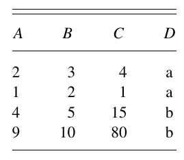
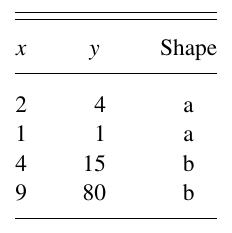
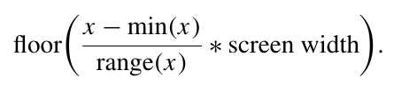
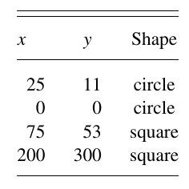
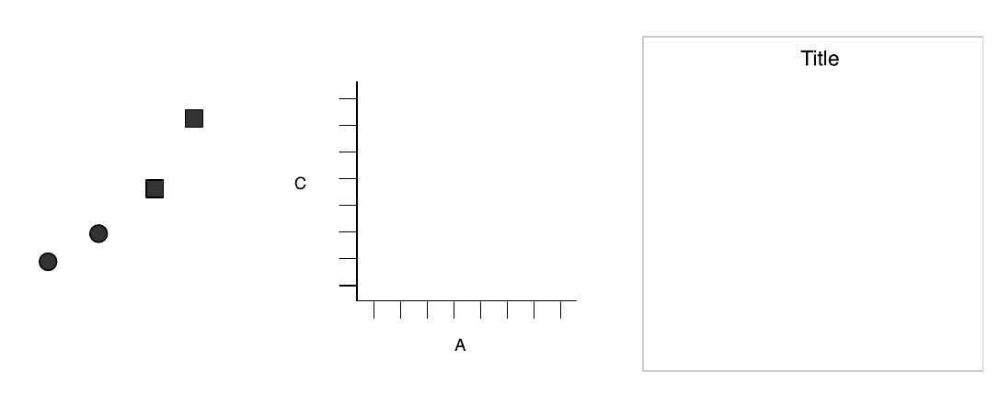
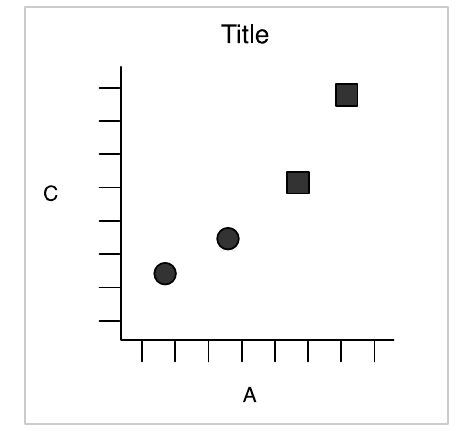
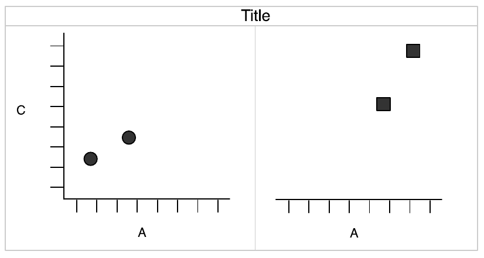
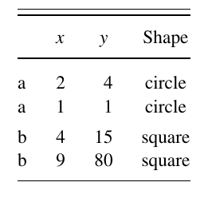

## Libraries
```{r}
library(tidyverse)
```

## Welcome

In today's workshop, we are going to cover the fundamentals of data visualization using `ggplot2`. There are many, many ways to visualize your data, so rather than attempting to do an exhaustive overview of how to produce different plots, we are going to delve into the theoretical underpinnnings of how `ggplot2` operates. This will give you a solid foundation to build upon and make compelling data visualizations that suit your specific needs.

The content of this tutorial is based largely on the [RStudio "Visualize Data" Primers](https://rstudio.cloud/learn/primers/3) and Hadley Wickham's 2010 paper, ["The Layered Grammar of Graphics"](http://vita.had.co.nz/papers/layered-grammar.pdf). In this paper, Wickham describes the fundamental principles (i.e., grammar) that govern how graphics are constructed in `ggplot2`. A good grammer:

- Allows us to gain insight into the composition of complicated graphics
- Reveals unexpected connections between seemingly different graphics
- Provides a strong foundation for understanding a diverse range of graphics

Once we've developed an understanding of the grammar of graphics in `ggplot2`, I'll direct you to some resources where you can start playing around with more advanced data visualizations that best suit your data.

## How to build a plot

Every plot starts with data. Before we begin, let's first review a few important definitions:

- A **variable** is a quantity, quality, or property that you can measure.
- A **value** is the state of a variable when you measure it. The value of a variable may change from measurement to measurement.
- An **observation** or case is a set of measurements made under similar conditions (you usually make all of the measurements in an observation at the same time and on the same object). An observation will contain several values, each associated with a different variable. I’ll sometimes refer to an observation as a case or data point.
- **Tabular data** is a table of values, each associated with a variable and an observation. Tabular data is tidy if each value is placed in its own cell, each variable in its own column, and each observation in its own row.

We use visualization as a tool for data exploration. During this exploratory phase, two questions can help guide your research:

- What type of variation occurs within my variables?
- What type of covariation occurs between my variables?

How you visualize this variation/covariation will depend on whether your data is categorical or continuous. A variable is categorical if it can take only one of a small set of values. In R, categorical variables are usually saved as factors or character vectors. A variable is continuous if it can take any of an infinite set of smooth, ordered values. Here, smooth means that if you order the values on a line, an infinite number of values would exist between any two points on the line. For example, an infinite number of values exists between 0 and 1, e.g. 0.9, 0.99, 0.999, and so on. The figure below provides a useful starting point for determining what visualization method is most appropriate given your data.


On the most basic level, every ggplot2 plot has three key components:

1. data,

2. A set of aesthetic mappings between variables in the data and visual properties, and

3. At least one layer which describes how to render each observation. Layers are usually created with a geom function.


### A basic plot

In this first example, we'll look at a scatterplot using a very simple dataset composed of four variables (*A*, *B*, *C*, and *D*) and four observations. This plot will draw a point for each observation, and we will position the point horizontally according to the value of *A*, and verically according to *C*. For this example, we will also map categorical variable *D* to the shape of the points.

Our simple dataset:



The first step in making this plot is to create a new dataset that reflects the mapping of *x*-position to *A*, *y*-position to *C*, and shape to *D*. *x*-position, *y*-position, and shape are examples of aesthetics, things that we can perceive on the graphics. This is one of the key components of the layered grammer of graphics in `ggplot2` that we will cover in more depth in the next section.

Simple dataset with variables named according to the aesthetic that they use:




We can create many different types of plots using this same basic specification. For example, if we were to draw lines instead of points, we would get a line plot. If we used bars, we would get a bar plot. Bars, lines, and points are all examples of geometric objects. Like aesthetics, geometric objects are part of the layered grammar we will be covering in the next section.

The next thing we need to do is to convert these numbers measured in data units to numbers measured in physical units, things that the computer can display. The position of a point on a graph is determined by a coordinate system. For example, to convert from a continuous data value to a horizontal pixel coordinate, we need a function like the following:



In this example, we will scale the *x*-position to [0, 200] and the *y*-position to [0, 300]. A similar mapping procedure is used for other aesthetics as well. In `ggplot2` the shape (or color) of the point is determined by a scale. The specifics of these layers (coordinate system, scale) will also be described in more depth in the next section. 

Simple dataset with variables mapped into aesthetic space:




Finally, we need to render these data to create the graphical objects that are displayed on screen or paper. To create a complete plot we need to combine graphical objects from three sources:

1. The *data*, represented by the point geom
2. The *scales and coordinate system*, which generates axes and legends so that we can read values from the graph
3. The *plot annotations*, such as the background and plot title

Graphics objects produced by (from left to right): geometric objects, scales and coordinate system, plot annotations:



A final graphic, produced by combining the graphical objects described and illustrated above:



### A more complicated plot

Now that you are acquainted with the components of a simple plot, we will create a more complicated plot that uses faceting. Faceting is a more general case of the techniques known as conditioning, trellising, and latticing, and produces small multiples showing different subsets of the data. If we facet the prvious plot by *D* we will get a plot that looks like this:



Faceting splits the original data set into a dataset for each subset, so the data that underlie the figure above look like this:



When producing faceted plots, there are some differences in the scaling process to ensure that the faceted data are correctly mapped to aesthetics. This is especially important if you are using non-linear scales (e.g., log-transformed data). For more information on this, be sure to read section 2.2 from [Wickham, 2010](http://vita.had.co.nz/papers/layered-grammar.pdf).

## Components of the layered grammar

In the examples above, we have seen some of the components that make up a plot: data and aesthetic mappings, geometric objects, scales, and facet specification. We have also touched on two other components: statistical tranformations and the coordinate system. Together, the data, mappings, statistical transformation, and geometric object form a layer. A plot may have multiple layers, for example, when we overlay a scatterplot with a smoothed line.

The layered grammar defines the components of a plot as:

- a default dataset and set of mappings from variables to aesthetics,
- one or more layers, with each layer having one geometric object, one statistical transformation, one position adjustment, and optionally, one dataset and set of aesthetic mappings,
- one scale for each aesthetic mapping used,
- a coordinate system,
- the facet specification.

This framework has several benefits for the user:

1. It makes it easier to iteratively update a plot, changing a single feature at a time.
2. It suggests the high-level aspects of a plot that *can* be changed, giving us a framework to think about graphics.
3. It encourages the use of graphics customized to a particular problem rather than relying on generic named graphics.

### Layers

Layers are responsible for creating the objects that we perceive on the plot. A layer is composed of four parts:

1. data and aesthetic mapping
2. a statistical transformation (stat)
3. a geometric object (geom)
4. a position adjustment

#### Data and mapping

Data are obviously a
#### Statistical transformation
#### Geometric object
#### Position adjustment

### Scales
### Coordinate system
### Faceting

## A hierarchy of defaults

## An embedded grammar

## Implications of the layered grammar

### Histograms
### Polar coordinates
### Transformations

## Conclusions

- [The R Graph Gallery](https://www.r-graph-gallery.com/)
- [From Data to Viz](https://www.data-to-viz.com/)

## Resources

- [RStudio Primers](https://rstudio.cloud/learn/primers)
- [RStudio Cheat Sheets](https://rstudio.cloud/learn/cheat-sheets)
- [R for Data Science book](https://r4ds.had.co.nz/)
- [R Graphics Cookbook](https://r-graphics.org/)

## Community

- [GC Digital Initiatives](https://gcdi.commons.gc.cuny.edu/calendar/)
- [R Users' Group](https://commons.gc.cuny.edu/groups/rug-r-users-group/)
- [R for Data Science Slack Group](https://www.rfordatasci.com/)